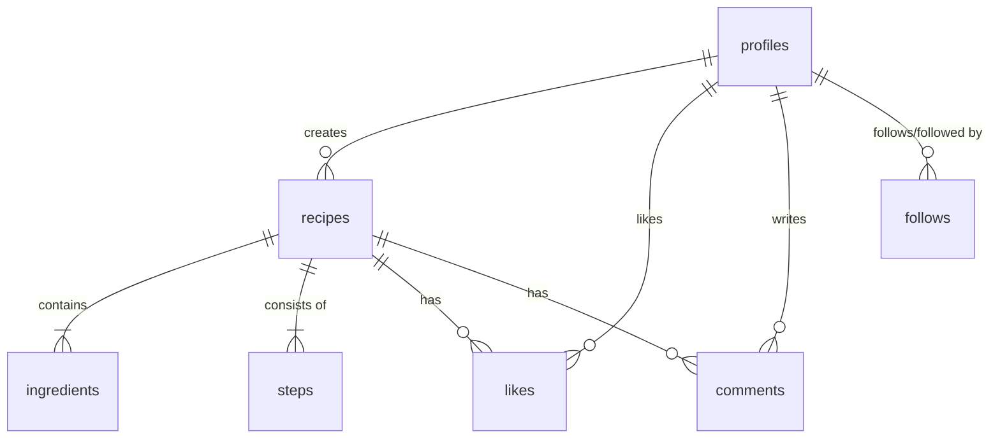

# Database Schema: Digital Cookbook

> ⚠️ **Historical document — describes the original base schema only.** Twenty-two migrations have landed since this was written (tags, cookbooks, meal plans, reports, notifications, comment likes, admin/MFA columns, and more). The current sources of truth are the numbered SQL files in [supabase_migration/](./supabase_migration/) and the per-migration rationale in [refs/DATABASE_DECISIONS.md](./refs/DATABASE_DECISIONS.md).

This schema is designed for **PostgreSQL** (via Supabase) and follows a relational structure to support the social and recipe management features.

## Tables Overview

### 1. `profiles`
Extends the internal Supabase `auth.users` table with public-facing info.
- `id`: uuid (Primary Key, references auth.users)
- `username`: text (Unique)
- `full_name`: text
- `avatar_url`: text
- `bio`: text
- `updated_at`: timestamp

### 2. `recipes`
The core recipe data.
- `id`: uuid (Primary Key)
- `author_id`: uuid (References profiles.id)
- `title`: text
- `description`: text
- `image_url`: text
- `servings`: int
- `is_public`: boolean (default: true)
- `created_at`: timestamp

### 3. `ingredients`
Individual components of a recipe.
- `id`: uuid (Primary Key)
- `recipe_id`: uuid (References recipes.id, ON DELETE CASCADE)
- `name`: text
- `quantity`: numeric
- `unit`: text (e.g., grams, cups, pieces)
- `order_index`: int (To maintain user's preferred list order)

### 4. `steps`
Cooking instructions.
- `id`: uuid (Primary Key)
- `recipe_id`: uuid (References recipes.id, ON DELETE CASCADE)
- `step_number`: int
- `instruction`: text
- `image_url`: text (Optional per-step image)

### 5. `social_metrics` (Likes / Favorites / Follows)

#### `likes`
- `user_id`: uuid (References profiles.id)
- `recipe_id`: uuid (References recipes.id)
- *Primary Key: (user_id, recipe_id)*

#### `favorites`
- `user_id`: uuid (References profiles.id)
- `recipe_id`: uuid (References recipes.id)
- *Primary Key: (user_id, recipe_id)*

#### `follows`
- `follower_id`: uuid (References profiles.id)
- `following_id`: uuid (References profiles.id)
- *Primary Key: (follower_id, following_id)*

### 6. `comments`
- `id`: uuid (Primary Key)
- `recipe_id`: uuid (References recipes.id)
- `user_id`: uuid (References profiles.id)
- `content`: text
- `created_at`: timestamp

---

## Relationships Diagram (Mermaid)

## Security (Row Level Security)
- **Profiles**: Anyone can read, only the owner can update.
- **Recipes**: Anyone can read if `is_public` is true. Only the author can create/update/delete.
- **Social**: Authenticated users can create. Only the owner can delete their own likes/comments.
